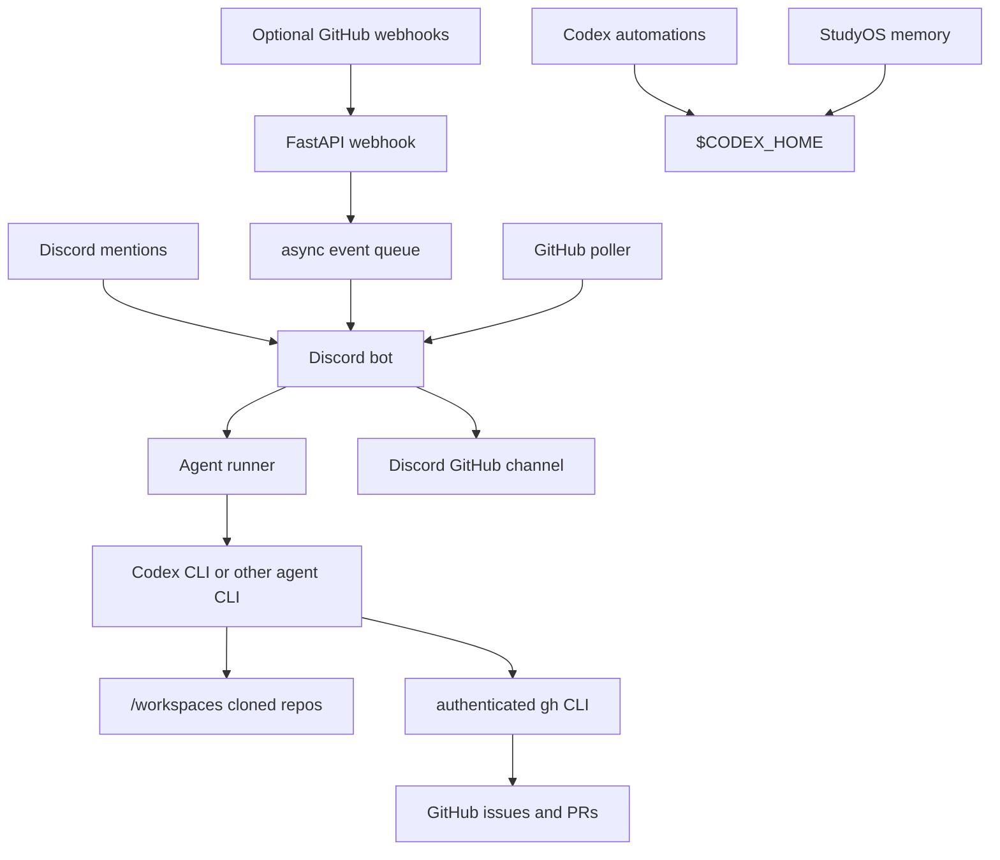

<div align="center">

# StudyOS Agent Gateway

Discord and GitHub gateway for shared StudyOS coding agents.


</div>

`StudyOS Agent Gateway` connects the StudyOS Discord server with GitHub pull requests, issues, and agent workflows. It is a gateway tool for the StudyOS course monorepo, not the course repository itself.

The goal is to give the whole StudyOS cohort one shared interface to a few deployed coding-agent instances. Not every participant needs their own Codex or Claude subscription. A small number of authenticated agent servers can listen to Discord messages, GitHub webhooks, and scheduled triage jobs, then help with issues, reviews, pull requests, and repository maintenance through the same GitHub and Discord surfaces everyone already uses.

The Python service receives Discord mentions and optional GitHub webhooks, then invokes the configured agent command. Repository writes are done by the authenticated agent runtime through tools like `gh`, while implementation starts, PR approval, and PR merges remain human-gated.

## Features

- Mention-first Discord collaboration: tag the bot to start a scoped task, then send
  unmentioned follow-ups while that exact task is active.
- FastAPI webhook endpoint for GitHub `pull_request`, `issues`, and `issue_comment` events.
- HMAC verification for GitHub webhook payloads.
- Configurable Discord channel for PR and issue notifications.
- Read-only GitHub REST client for polling open PRs and issues.
- Agent runner through `AGENT_COMMAND`, or external bridge through `AGENT_WEBHOOK_URL`.
- Local `studyos-discord-context` tool so agents can fetch recent channel context on demand.
- Codex channel sessions: Discord channels can resume their own persisted Codex CLI session.
- Discord attachment handoff: uploaded files are saved locally and image attachments are passed to Codex with `-i` when possible.
- Discord artifact uploads: agents can return generated diagrams, images, or documents for the bot to post back into the channel.
- `studyos-render-diagram` helper for rendering Graphviz DOT diagrams to PNG/SVG/PDF inside the agent image.
- Disabled-by-default, high-signal proactive monitor for private `group-*` spaces; it stays silent unless a settled technical blocker has a concrete answer.
- Short Discord-native replies, with long Markdown, fenced code, logs, and structured write-ups moved into attachments automatically.
- Optional PR review summaries and issue refinement prompts on GitHub webhook events.
- Periodic GitHub triage loop for open PRs and issues.
- Seeded Codex app automations for triage, review nudges, issue refinement, implementation candidate discovery, a coordinator heartbeat, and a weekly digest.
- Docker and Docker Compose setup, including an agent image with `gh`, `git`, SSH, Node/npm, and Codex CLI installed.
- Shared-agent deployment model for StudyOS course participants.

## Architecture



The gateway owns Discord, webhook intake, lightweight polling, prompt assembly, and delivery back to Discord. The agent runtime owns reasoning and repository work in cloned repositories under `/workspaces`. Codex app automations are seeded into the Codex automation path; their TOML `status` controls whether a deployment with a real Codex automation runner executes them.

## Quick Start

Create a Discord application and bot, enable the message content intent, then invite it to the server with the bot scope.

```bash
cp .env.example .env
python3 -m venv .venv
source .venv/bin/activate
pip install -e ".[dev]"
studyos-agent-gateway
```

For Docker:

```bash
cp .env.example .env
docker compose up --build
```

For an agent-enabled Codex container:

```bash
AGENT_COMMAND="codex exec --json --dangerously-bypass-approvals-and-sandbox --cd /workspaces -"
AGENT_WORKDIR=/workspaces
docker compose -f docker-compose.agent.yml up --build
```

The agent image seeds Codex defaults from `codex/config.toml` into
`$CODEX_HOME/config.toml`:

```toml
model = "gpt-5.6-sol"
model_reasoning_effort = "medium"
```

The agent image is only the harness: Discord/GitHub gateway, Codex CLI, GitHub
CLI, auth volumes, and instructions. It does not need a course repository baked
in or mounted at build time. Students can share GitHub URLs in Discord; the
agent can clone/fetch them into the persistent `/workspaces` volume and work
there.

On startup the gateway seeds `$CODEX_HOME/AGENTS.md` and
`$CODEX_HOME/memories/studyos-course.md` if they do not exist. The canonical
course memory lives in `codex/memories/studyos-course.md` in this repository;
the Docker runtime copies it into Codex home. Global `AGENTS.md` makes Codex
inherit reusable working agreements in the Docker runtime, while the memory
file is the StudyOS project entry point for course context, product direction,
collaboration policy, and tone.

Discord prompts also include the source channel and message id. When a request depends on previous Discord discussion, the agent is instructed to run the local context tool instead of guessing:

```bash
studyos-discord-context --channel-id 123 --around-message-id 456 --limit 20
```

When `AGENT_CHANNEL_SESSIONS_ENABLED=true`, Discord mentions handled by a Codex
`AGENT_COMMAND` run through one persistent `codex app-server` process and store a
mapping from Discord channel ID to Codex thread ID under
`$CODEX_HOME/gateway/discord-channel-sessions.json`. A follow-up mention during
an active turn uses `turn/steer` with the exact active turn ID instead of
cancelling the work or starting a second response. A stop request uses
`turn/interrupt`. Different channels can run concurrently.

Each Discord task creates one temporary native progress card. App-server lifecycle,
structured plan, command, file, tool, and safe commentary events edit that same
message. Longer tasks display the current Codex plan as a bounded checklist and
provide a requester-only **Stop task** button. Discord delivers button clicks over
the bot's existing Gateway connection, so the Jetson does not need a public callback
port. The gateway sends the final response first and then removes the progress card,
so normal operation leaves only the final answer in the channel.

While a task is active, the person who started it can steer it with an ordinary
message in the same Discord channel or thread. Unmentioned messages never start or
resume an idle task, and another user's ambient messages are ignored. A fresh task
still requires mentioning the bot.

For Discord-originated Codex sessions, `AGENT_DISCORD_WORKTREE_ROOT` gives each
originating channel or thread a persistent working root such as
`/workspaces/.studyos-discord-worktrees/<channel-id>`. When a request mentions
exactly one `Tue-StudyOS/<repo-name>` repository, the gateway clones or reuses
the canonical checkout under `/workspaces/Tue-StudyOS/<repo-name>`, creates or
reuses a detached git worktree under that channel/thread root, and starts the
initial Codex session there. If the target repository is not yet clear, Codex
starts in the channel/thread root and is prompted to create repo-specific
worktrees there before editing repository files.

This keeps separate group channels, Discord threads, and subtasks from editing
the same checkout at once. If a runtime exposes subagents or delegation tools,
Codex is instructed to use them for independent subtasks; otherwise it should
continue locally and say that subagents are unavailable.

Discord attachments on a mention are downloaded into `DISCORD_ATTACHMENT_DIR`.
Image attachments are passed to app-server as `localImage` inputs in addition
to being listed in the prompt. When an agent creates a file that should be posted back to
Discord, it returns a final JSON object:

```json
{"message": "diagram ready", "files": ["/tmp/studyos-artifacts/flow.png"]}
```

The gateway also detects local file links like
`[slides.pdf](/workspace/output/slides.pdf)` in plain agent replies and uploads
those files in the same Discord response. Oversized replies, Markdown documents,
and fenced code are also moved into a `.md` attachment automatically, leaving
only a short caption in chat. Local paths are not useful to Discord
users, so file requests should produce attachments by default. The gateway only
uploads files under `DISCORD_ARTIFACT_ALLOWED_ROOTS`, with
`/tmp/studyos-artifacts`, `/workspaces`, and legacy `/workspace` allowed by
default.

The agent image also includes static Codex app automations under
`codex/automations/`. Container startup copies those files into
`$CODEX_HOME/automations/` without overwriting local edits. A seeded automation
can be enabled by changing its TOML `status` to `ACTIVE`; automations that
already ship as `ACTIVE` run when the mounted Codex home is managed by a Codex
automation runner.

Authenticate the CLIs once inside the running container:

```bash
docker compose -f docker-compose.agent.yml exec studyos-agent-gateway gh auth login
docker compose -f docker-compose.agent.yml exec studyos-agent-gateway codex login
```

## Configuration

| Variable | Purpose |
| --- | --- |
| `DISCORD_TOKEN` | Discord bot token |
| `DISCORD_GUILD_ID` | Optional guild ID used to clear old commands faster |
| `DISCORD_PR_CHANNEL_ID` | Optional Discord channel ID for GitHub notification mirrors and poller summaries |
| `GITHUB_WEBHOOK_SECRET` | Secret configured on the GitHub webhook |
| `GITHUB_TOKEN` | Optional fallback token; `gh auth login` is the preferred agent-server path |
| `GITHUB_REPOSITORY` | Default repository in `owner/name` form |
| `GITHUB_POLL_ENABLED` | Periodically asks the agent to triage open PRs/issues |
| `GITHUB_POLL_INTERVAL_SECONDS` | Poll interval, for example `900` or `1800` |
| `DISCORD_MESSAGE_AGENT_ENABLED` | Enables mention-based Discord collaboration |
| `DISCORD_ATTACHMENT_DIR` | Local directory for Discord message attachments |
| `DISCORD_ARTIFACT_ALLOWED_ROOTS` | Comma-separated roots the bot may upload files from |
| `DISCORD_ARTIFACT_MAX_BYTES` | Maximum generated file size for Discord upload |
| `DISCORD_PROACTIVE_AGENT_ENABLED` | Enables the opt-in high-signal monitor for private `group-*` channels and their threads |
| `DISCORD_PROACTIVE_INTERVAL_SECONDS` | Proactive monitor interval |
| `DISCORD_PROACTIVE_RECENT_ACTIVITY_SECONDS` | Maximum age of latest human message before a channel is skipped |
| `DISCORD_PROACTIVE_MIN_POST_INTERVAL_SECONDS` | Per-channel cooldown after the bot sends a proactive reply |
| `DISCORD_PROACTIVE_DRY_RUN` | Logs proactive replies instead of sending them |
| `AGENT_COMMAND` | Local agent CLI command, prompt is passed on stdin |
| `AGENT_WORKDIR` | Working directory for the agent command |
| `AGENT_TIMEOUT_SECONDS` | Max runtime for one agent invocation |
| `AGENT_AUTO_REVIEW_ENABLED` | Runs the agent on useful GitHub webhook events |
| `AGENT_CHANNEL_SESSIONS_ENABLED` | Resume one Codex session per Discord channel when `AGENT_COMMAND` is `codex exec` |
| `AGENT_SESSION_STORE_PATH` | Optional override for the Discord channel to Codex session JSON store |
| `AGENT_DISCORD_WORKTREE_ROOT` | Per Discord channel/thread root for parallel Codex worktrees |
| `AGENT_WEBHOOK_URL` | Optional external agent endpoint instead of local CLI |

See [`.env.example`](./.env.example) for all supported options.

For Codex runtime options, including local providers, see [Agent Runtime Design](./docs/agent-runtime.md). For gateway design notes and broader Codex integration options, see [Gateway Research Notes](./docs/gateway-research.md).
For the current StudyOS workflow, review policy, and automation set, see [StudyOS Collaboration Workflow Notes](./docs/studyos-collaboration-workflow.md).

## GitHub Webhook

Configure the monorepo webhook to call:

```text
https://<your-host>/webhooks/github
```

Recommended events if you want webhook-triggered updates:

- Pull requests
- Issues
- Issue comments

Set the webhook content type to `application/json` and use the same secret as `GITHUB_WEBHOOK_SECRET`.

For mention-only testing, you can skip GitHub webhooks. Set `GITHUB_WEBHOOK_SECRET`
and `AGENT_AUTO_REVIEW_ENABLED=true` when you want GitHub events to trigger the
agent. Set `DISCORD_PR_CHANNEL_ID` only when you also want webhook notifications
or scheduled triage summaries mirrored into Discord.

## GitHub Permissions

The preferred deployment path is `gh auth login` inside the agent container or on the host. The Python GitHub client will use `GITHUB_TOKEN` when set, otherwise it will try `gh auth token`.

For a fine-grained token fallback used by polling, grant only the repositories you need:

- Pull requests: read
- Issues: read
- Metadata: read

Agent-side write access, if enabled through `gh auth login`, should be governed by branch protection and the runtime prompt. The bot does not expose a merge command. StudyOS students approve and merge PRs manually through GitHub.

## Agent Runner

The bot does not embed one specific agent framework. Instead, Discord mentions, optional webhooks, and the poller call one configured runner.

Examples:

```bash
AGENT_COMMAND="codex exec --json --dangerously-bypass-approvals-and-sandbox --cd /workspaces -"
AGENT_COMMAND="claude -p --permission-mode acceptEdits"
AGENT_COMMAND="/opt/picoclaw/bin/picoclaw run --stdin"
```

For Codex, authenticate once in the agent container or mount an existing `CODEX_HOME`. For GitHub, authenticate with `gh auth login` in the same container. For Claude Code, authenticate on the deployment machine or use its supported long-lived token setup. The point is to run a few trusted StudyOS agent instances for the cohort, while keeping repository writes protected by branch protection, review norms, and GitHub token scopes.

The simplest operating mode does not require GitHub webhooks: run the authenticated CLI runtime and let Codex periodically inspect issues, comments, and PRs with `gh`. Webhooks are only a low-latency trigger when that is worth the extra setup.

Implementation is intentionally human-gated. The agent may refine issues, propose plans, summarize PRs, and answer review questions. It should start a branch or PR only after a human explicitly asks for implementation in Discord or a GitHub issue comment. It must never merge PRs.

## Scheduled Work

Set `GITHUB_POLL_ENABLED=true` to make the bot check open PRs and issues every `GITHUB_POLL_INTERVAL_SECONDS`. The poller builds one triage prompt and sends it to the configured agent runner. That is the right place for tasks like:

- summarize stale PRs
- unify duplicate issues
- ask refinement questions on blocked work
- invite reviewers for new PRs

Codex automations are seeded under `$CODEX_HOME/automations/`:

- `studyos-github-triage`: inspect issues, PRs, comments, and review activity every 30 minutes.
- `studyos-pr-review-nudge`: find PRs that need review attention every 2 hours.
- `studyos-issue-refinement`: find vague or duplicate issues every 6 hours.
- `studyos-implementation-candidates`: identify ready work daily, but do not implement unattended.
- `studyos-coordinator-thread`: heartbeat automation for a long-lived coordinator thread; replace `REPLACE_WITH_CODEX_THREAD_ID` before enabling.
- `studyos-group-channel-digest`: summarize meaningful group-channel activity into `#updates` daily.
- `studyos-weekly-digest`: Thursday 16:00 course progress digest.

The image contains tools, not credentials. Do not bake GitHub auth, Codex auth, Claude auth, SSH keys, or Discord tokens into the image.

Agents can create diagrams with Graphviz in the agent image:

```bash
studyos-render-diagram --input /tmp/studyos-artifacts/flow.dot --output /tmp/studyos-artifacts/flow.png
```

## Development

```bash
ruff check .
pyright
pytest
```

## License

MIT. See [LICENSE](./LICENSE).
