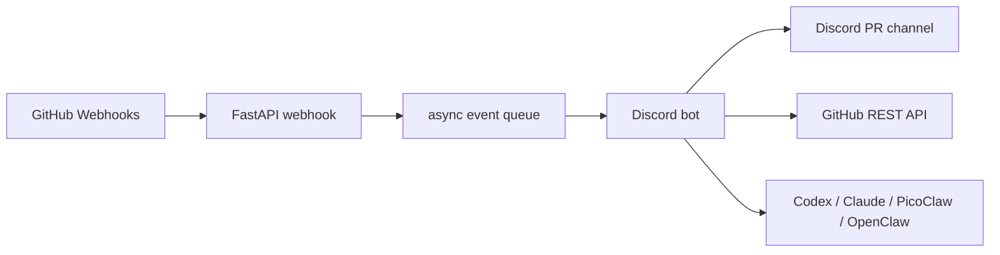

<div align="center">

# study-discord-agent

Discord bot and GitHub bridge for student project collaboration.


</div>

`study-discord-agent` connects a course Discord server with GitHub pull requests, issues, and agent workflows. It is designed for a shared monorepo where students collaborate through PRs and use one Discord channel for review visibility.

The intended deployment is a small server or container where Codex, Claude Code, PicoClaw, OpenClaw, or a custom course agent is already authenticated. The Python bot is the Discord/GitHub gateway: it receives messages and GitHub webhooks, invokes the configured agent command, and gates GitHub write actions.

## Features

- Discord bot with `/study ping`, `/study pr-comment`, `/study pr-merge`, and `/study agent` commands.
- FastAPI webhook endpoint for GitHub `pull_request` and `issues` events.
- HMAC verification for GitHub webhook payloads.
- Configurable Discord channel for PR and issue notifications.
- GitHub REST client for issue/PR comments, issue closure, and PR merges.
- Write actions disabled by default until `GITHUB_WRITE_ENABLED=true`.
- Agent runner through `AGENT_COMMAND`, or external bridge through `AGENT_WEBHOOK_URL`.
- Optional automatic PR review summaries on GitHub webhook events.
- Docker and Docker Compose setup, including an agent image with Codex CLI installed.

## Architecture



## Quick Start

Create a Discord application and bot, then invite it to the server with bot and application command scopes.

```bash
cp .env.example .env
python3 -m venv .venv
source .venv/bin/activate
pip install -e ".[dev]"
study-discord-agent
```

For Docker:

```bash
cp .env.example .env
docker compose up --build
```

For an agent-enabled Codex container:

```bash
AGENT_COMMAND="codex exec --full-auto --cd /workspace -"
AGENT_WORKDIR=/workspace
COURSE_REPO_PATH=/path/to/course-monorepo
docker compose -f docker-compose.agent.yml up --build
```

## Configuration

| Variable | Purpose |
| --- | --- |
| `DISCORD_TOKEN` | Discord bot token |
| `DISCORD_GUILD_ID` | Optional guild ID for faster slash command sync |
| `DISCORD_PR_CHANNEL_ID` | Discord channel ID for GitHub notifications |
| `GITHUB_WEBHOOK_SECRET` | Secret configured on the GitHub webhook |
| `GITHUB_TOKEN` | Fine-grained token or GitHub App installation token |
| `GITHUB_REPOSITORY` | Default repository in `owner/name` form |
| `GITHUB_WRITE_ENABLED` | Enables PR comments, issue closure, and PR merges |
| `ALLOWED_DISCORD_ROLE_IDS` | Comma-separated role IDs allowed to run write commands |
| `AGENT_COMMAND` | Local agent CLI command, prompt is passed on stdin |
| `AGENT_WORKDIR` | Working directory for the agent command |
| `AGENT_TIMEOUT_SECONDS` | Max runtime for one agent invocation |
| `AGENT_AUTO_REVIEW_ENABLED` | Runs the agent on PR webhook events |
| `AGENT_WEBHOOK_URL` | Optional external agent endpoint instead of local CLI |

See [`.env.example`](./.env.example) for all supported options.

## GitHub Webhook

Configure the monorepo webhook to call:

```text
https://<your-host>/webhooks/github
```

Recommended events:

- Pull requests
- Issues

Set the webhook content type to `application/json` and use the same secret as `GITHUB_WEBHOOK_SECRET`.

## GitHub Permissions

For a fine-grained token, grant only the repositories you need and the smallest permissions that match enabled commands:

- Pull requests: read/write for merge operations
- Issues: read/write for comments and issue closure
- Metadata: read

Leave `GITHUB_WRITE_ENABLED=false` while testing notifications.

## Agent Runner

The bot does not embed one specific agent framework. Instead, `/study agent` and optional PR automation call one configured runner.

Examples:

```bash
AGENT_COMMAND="codex exec --full-auto --cd /workspace -"
AGENT_COMMAND="claude -p --permission-mode acceptEdits"
AGENT_COMMAND="/opt/picoclaw/bin/picoclaw run --stdin"
```

For Codex, authenticate once on the host and mount `CODEX_HOME` read-only into the agent container. For Claude Code, authenticate on the deployment machine or use its supported long-lived token setup. Keep repository writes protected by branch protection and GitHub token scopes.

## Development

```bash
ruff check .
pyright
pytest
```

## License

MIT. See [LICENSE](./LICENSE).
