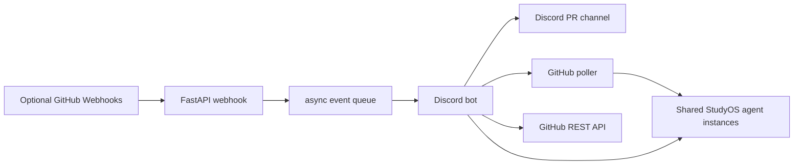

<div align="center">

# StudyOS Agent Gateway

Discord and GitHub gateway for shared StudyOS coding agents.


</div>

`StudyOS Agent Gateway` connects the StudyOS Discord server with GitHub pull requests, issues, and agent workflows. It is a gateway tool for the StudyOS course monorepo, not the course repository itself.

The goal is to give the whole StudyOS cohort one shared interface to a few deployed coding-agent instances. Not every participant needs their own Codex or Claude subscription. A small number of authenticated agent servers can listen to Discord messages, GitHub webhooks, and scheduled triage jobs, then help with issues, reviews, pull requests, and repository maintenance through the same GitHub and Discord surfaces everyone already uses.

The Python service receives Discord mentions and optional GitHub webhooks, then invokes the configured agent command. Repository writes are done by the authenticated agent runtime through tools like `gh`, while PR merges remain human-only in GitHub.

## Features

- Mention-first Discord collaboration: tag the bot to brainstorm, ask technical questions, research, or start a scoped task.
- FastAPI webhook endpoint for GitHub `pull_request`, `issues`, and `issue_comment` events.
- HMAC verification for GitHub webhook payloads.
- Configurable Discord channel for PR and issue notifications.
- Read-only GitHub REST client for polling open PRs and issues.
- Agent runner through `AGENT_COMMAND`, or external bridge through `AGENT_WEBHOOK_URL`.
- Optional automatic PR review summaries and issue refinement prompts on GitHub webhook events.
- Periodic GitHub triage loop for open PRs and issues.
- Docker and Docker Compose setup, including an agent image with `gh`, `git`, SSH, Node/npm, and Codex CLI installed.
- Shared-agent deployment model for StudyOS course participants.

## Architecture



## Quick Start

Create a Discord application and bot, enable the message content intent, then invite it to the server with the bot scope.

```bash
cp .env.example .env
python3 -m venv .venv
source .venv/bin/activate
pip install -e ".[dev]"
studyos-agent-gateway
```

For Docker:

```bash
cp .env.example .env
docker compose up --build
```

For an agent-enabled Codex container:

```bash
AGENT_COMMAND="codex exec --json --dangerously-bypass-approvals-and-sandbox --cd /workspace -"
AGENT_WORKDIR=/workspace
COURSE_REPO_PATH=/path/to/studyos-monorepo
docker compose -f docker-compose.agent.yml up --build
```

Set the Codex defaults once inside the persisted `codex-auth` volume:

```toml
model = "gpt-5.5"
model_reasoning_effort = "high"
```

Authenticate the CLIs once inside the running container:

```bash
docker compose -f docker-compose.agent.yml exec studyos-agent-gateway gh auth login
docker compose -f docker-compose.agent.yml exec studyos-agent-gateway codex login
```

## Configuration

| Variable | Purpose |
| --- | --- |
| `DISCORD_TOKEN` | Discord bot token |
| `DISCORD_GUILD_ID` | Optional guild ID used to clear old commands faster |
| `DISCORD_PR_CHANNEL_ID` | Discord channel ID for GitHub notifications and poller summaries |
| `GITHUB_WEBHOOK_SECRET` | Secret configured on the GitHub webhook |
| `GITHUB_TOKEN` | Optional fallback token; `gh auth login` is the preferred agent-server path |
| `GITHUB_REPOSITORY` | Default repository in `owner/name` form |
| `GITHUB_POLL_ENABLED` | Periodically asks the agent to triage open PRs/issues |
| `GITHUB_POLL_INTERVAL_SECONDS` | Poll interval, for example `900` or `1800` |
| `DISCORD_MESSAGE_AGENT_ENABLED` | Enables mention-based Discord collaboration |
| `AGENT_COMMAND` | Local agent CLI command, prompt is passed on stdin |
| `AGENT_WORKDIR` | Working directory for the agent command |
| `AGENT_TIMEOUT_SECONDS` | Max runtime for one agent invocation |
| `AGENT_AUTO_REVIEW_ENABLED` | Runs the agent on PR webhook events |
| `AGENT_WEBHOOK_URL` | Optional external agent endpoint instead of local CLI |

See [`.env.example`](./.env.example) for all supported options.

For gateway design notes and Codex integration options, see [Gateway Research Notes](./docs/gateway-research.md).

## GitHub Webhook

Configure the monorepo webhook to call:

```text
https://<your-host>/webhooks/github
```

Recommended events if you want webhook-triggered updates:

- Pull requests
- Issues
- Issue comments

Set the webhook content type to `application/json` and use the same secret as `GITHUB_WEBHOOK_SECRET`.

For mention-only testing, you can skip GitHub webhooks. Set `GITHUB_WEBHOOK_SECRET` and `DISCORD_PR_CHANNEL_ID` when you want GitHub events or scheduled triage summaries to post into Discord.

## GitHub Permissions

The preferred deployment path is `gh auth login` inside the agent container or on the host. The Python GitHub client will use `GITHUB_TOKEN` when set, otherwise it will try `gh auth token`.

For a fine-grained token fallback used by polling, grant only the repositories you need:

- Pull requests: read
- Issues: read
- Metadata: read

Agent-side write access, if enabled through `gh auth login`, should be governed by branch protection and the runtime prompt. The bot does not expose a merge command, and StudyOS students merge PRs manually through GitHub.

## Agent Runner

The bot does not embed one specific agent framework. Instead, Discord mentions, optional webhooks, and the poller call one configured runner.

Examples:

```bash
AGENT_COMMAND="codex exec --json --dangerously-bypass-approvals-and-sandbox --cd /workspace -"
AGENT_COMMAND="claude -p --permission-mode acceptEdits"
AGENT_COMMAND="/opt/picoclaw/bin/picoclaw run --stdin"
```

For Codex, authenticate once in the agent container or mount an existing `CODEX_HOME`. For GitHub, authenticate with `gh auth login` in the same container. For Claude Code, authenticate on the deployment machine or use its supported long-lived token setup. The point is to run a few trusted StudyOS agent instances for the cohort, while keeping repository writes protected by branch protection, review norms, and GitHub token scopes.

The simplest operating mode does not require GitHub webhooks: run the authenticated CLI runtime and let Codex periodically inspect issues, comments, and PRs with `gh`. Webhooks are only a low-latency trigger when that is worth the extra setup.

## Scheduled Triage

Set `GITHUB_POLL_ENABLED=true` to make the bot check open PRs and issues every `GITHUB_POLL_INTERVAL_SECONDS`. The poller builds one triage prompt and sends it to the configured agent runner. That is the right place for tasks like:

- summarize stale PRs
- unify duplicate issues
- ask refinement questions on blocked work
- invite reviewers for new PRs
- start small implementations and create PRs

The image contains tools, not credentials. Do not bake GitHub auth, Codex auth, Claude auth, SSH keys, or Discord tokens into the image.

## Development

```bash
ruff check .
pyright
pytest
```

## License

MIT. See [LICENSE](./LICENSE).
